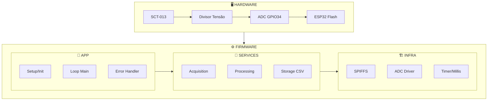
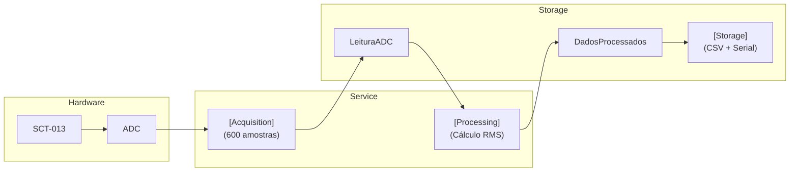
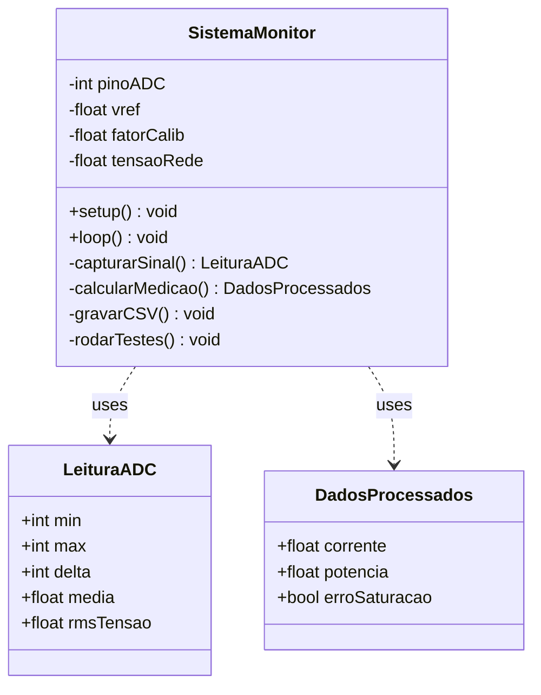

# Architecture Documentation - Monitor de Energia com ESP32 e SCT-013

> **Documento auxiliar, não evidência de validação.** A implementação real está em
> [`main.cpp`](../src/main.cpp). Exemplos de estados, logs e extensões abaixo podem representar
> arquitetura proposta e não necessariamente código implementado. O fluxo ainda precisa de
> teste integrado.

## Visão Geral da Arquitetura

O sistema é um monitor de energia elétrica embarcado baseado em ESP32, projetado para aquisição contínua de dados de corrente e potência, com armazenamento local em memória flash. A arquitetura segue o padrão de **aquisição-processamento-armazenamento**, com camadas bem definidas e separação de responsabilidades.

## Diagrama Arquitetural




## Componentes Arquiteturais

### 1. Hardware Layer
#### 1.1 Sensor SCT-013
- **Tipo**: Transformador de corrente (não invasivo)
- **Saída**: Tensão proporcional à corrente (0-1V)
- **Calibração**: Fator 29.0 (ajustável)

#### 1.2 Circuito de Condicionamento
- **Divisor de Tensão**: Reduz sinal para faixa do ADC (0-3.3V)
- **Offset**: Adiciona 1.65V para medição AC (meia escala)

#### 1.3 ADC do ESP32
- **Resolução**: 12 bits (0-4095)
- **Atenuação**: 11dB (faixa 0-3.3V)
- **GPIO**: 34 (ADC1_CH6), conforme o código atual; montagem física a confirmar

### 2. Firmware Architecture Patterns

#### 2.1 Padrão de Design: Observer (Temporal)
```cpp
// Loop principal com temporização baseada em millis()
if (millis() - ultimoTempo >= DELAY_GRAVACAO) {
    // Executa a cada período definido
}
```

#### 2.2 Padrão de Design: Strategy (Processamento)
```cpp
// Diferentes estratégias de processamento podem ser aplicadas
LeituraADC capturarSinal(...);      // Estratégia de aquisição
DadosProcessados calcularMedicao(...); // Estratégia de cálculo

```
### 3. Camada de Serviços (Service Layer)

#### 3.1 Acquisition Service (capturarSinal)

#### Responsabilidades

* Coleta de amostras com temporização precisa
* Cálculo de estatísticas básicas (min, max, média)
* Cálculo de RMS via variância

#### Entrada: Parâmetros do ADC (pino, quantidade, delay)

#### Saída: Estrutura LeituraADC


#### 3.2 Processing Service (calcularMedicao)

#### Responsabilidades

*Conversão de tensão para corrente
* Detecção de saturação
* Filtragem de ruído
* Cálculo de potência

#### Entrada: Estrutura LeituraADC

#### Saída: Estrutura DadosProcessados

#### 3.3 Storage Service (gravarRegistroCSV)

#### Responsabilidades:

* Formatação de dados para CSV
* Geração de timestamp
* Gravação em SPIFFS
* Espelhamento no Serial Monitor

#### Entrada: Corrente e Potência calculadas
#### Saída: Persistência em arquivo CSV

### 4. Fluxo de Dados



### 5. Gerenciamento de Estado
#### 5.1 Estados propostos do sistema (não implementados no código atual)

```cpp
enum SistemaEstado {
    INICIALIZACAO,      // Setup e testes
    COLETA_ATIVA,       // Loop principal
    ERRO_MEMORIA,       // Falha no SPIFFS
    ERRO_SATURACAO      // ADC saturado
};

```

#### 5.2 Variáveis Estáticas (Loop)
```cpp
static unsigned long ultimoTempo = 0;  // Controle de temporização
```
### 6. Estratégias de Tratamento de Erro

#### 6.1 Erro de Saturação

* Detecção: adc.min == 0 || adc.max >= 4095
* Ação: Alerta no Serial Monitor (não bloqueante)

#### 6.2 Erro de Offset
* Detecção: abs(teste.media - OFFSET_ESPERADO) > TOLERANCIA_OFFSET
* Ação: Falha no teste de hardware

#### 6.3 Erro de Ruído
* Detecção: teste.delta > RUIDO_MAXIMO
* Ação: Alerta no teste de hardware

#### 6.4 Erro de Memória
* Detecção: !SPIFFS.begin(true) ou falha em SPIFFS.open()
* Ação: Mensagem crítica, sistema continua (sem gravação)

### 7. Considerações de Performance
#### 7.1 Temporização
* Amostragem: 100µs entre amostras → 600 amostras em 60ms
* Processamento: ≈ 0.5ms (cálculos matemáticos)
* Gravação: ≈ 5-10ms (escrita SPIFFS)
* Ciclo Total: ≈ 70ms (dentro do período de 1s)

#### 7.2 Memória
* Stack: Uso mínimo (< 2KB)
* Heap: Alocação dinâmica apenas para strings (CSV)
* SPIFFS: Espaço reservado (depende da partição)

#### 7.3 Consumo Energético
* Ativo: ~100mA (WiFi desligado)
* Espera: ~50mA (entre amostragens)

### 8. Pontos de Extensão
``` cpp
// 1. Adicionar sensores de tensão
// 2. Modificar estratégia de filtragem
// 3. Implementar diferentes formatos de saída (JSON, MQTT)
// 4. Adicionar média móvel para suavização
// 5. Implementar detecção de pico para fator de potência

```
### 9. Dependências Externas
``` cpp
#include <Arduino.h>      // Core ESP32
#include <FS.h>           // File System API
#include <SPIFFS.h>       // SPIFFS Implementation

```

### 9. Dependências Externas

``` cpp

#include <Arduino.h>      // Core ESP32
#include <FS.h>           // File System API
#include <SPIFFS.h>       // SPIFFS Implementation

```

### 10. Matriz de Responsabilidades

### Matriz de Responsabilidades dos Componentes

| Componente / Função | Aquisição | Processamento | Armazenamento | Diagnóstico |
| :--- | :---: | :---: | :---: | :---: |
| `capturarSinal` | ✅ | ⚠️ (parcial) | ❌ | ❌ |
| `calcularMedicao` | ❌ | ✅ | ❌ | ❌ |
| `gravarRegistroCSV` | ❌ | ❌ | ✅ | ❌ |
| `rodarTestesHardware` | ✅ | ❌ | ❌ | ✅ |
| `iniciarSistemaMemoria` | ❌ | ❌ | ✅ | ✅ |


### 11. Fluxo de Inicialização (Timing Diagram)

### Cronograma de Inicialização (Boot Timeline)

| Tempo (ms) | Evento |
| :---: | :--- |
| `0` | Início do Setup |
| `1 – 10` | Inicialização Serial (115200 baud) |
| `10 – 20` | Configuração do ADC |
| `20 – 30` | Inicialização do SPIFFS |
| `30 – 50` | Criação / Verificação do Arquivo CSV |
| `50 – 80` | Testes de Hardware (offset, verificação de ruído) |
| `80 – 100` | Setup finalizado |
| `100+` | Loop Principal *(executado a cada 1000 ms)* |


### 12. Diagrama de Classes (UML-like)



### Trade-offs de Design

### Análise de Trade-offs e Decisões de Arquitetura

| Decisão Técnica | Benefício (Prós) | Custo / Desvantagem (Contras) |
| :--- | :--- | :--- |
| **SPIFFS vs. SD Card** | Integrado, sem hardware extra | Memória flash limitada |
| **`millis()` vs. `delay()`** | Execução não bloqueante | Implementação mais complexa |
| **Amostragem Síncrona** | Comportamento previsível e simples | Ocupa tempo de processamento da CPU |
| **Sem FPU (Ponto Flutuante)** | Código final menor | Cálculos matemáticos mais lentos |
| **CSV vs. Formato Binário** | Legível por humanos e universal | Maior overhead de armazenamento e CPU |


### 14. Security Considerations

* Acesso à Flash: SPIFFS sem proteção (dados não criptografados)
* Serial Monitor: Dados visíveis em debug (desabilitar em produção)
* Montagem: o SCT-013 é não invasivo, mas o trabalho próximo à rede exige procedimento de segurança

### 15. Monitoramento e Logging propostos
```cpp
// Níveis de log implementados
LOG_CRITICAL   // Falha SPIFFS
LOG_ERROR      // Falha na gravação
LOG_WARNING    // Saturação, ruído alto
LOG_INFO       // Setup, gravações normais
LOG_DEBUG      // Valores brutos (opcional)

```

### 16. Roadmap de Melhorias Sugeridas

1. Versão 2.0
   * Adicionar sensor de tensão (medida real)
   * Calcular fator de potência (cos φ)
   * Média móvel exponencial

2. Versão 3.0
   * Comunicação WiFi para dashboard
   * OTA (Over-The-Air) updates
   * Compressão de dados

3. Versão 4.0
   * Deep sleep entre amostragens
   * Detecção de eventos (picos, surtos)
   * Análise harmônica via FFT

> **Visão Geral da Arquitetura**
> 
> O sistema adota uma arquitetura monolítica em camadas, com clara separação entre as etapas de **aquisição**, **processamento** e **armazenamento**. 
> 
> O design prioriza **simplicidade**, **confiabilidade** e **baixo consumo de recursos**, tornando-o ideal para o monitoramento contínuo de energia em ambientes residenciais e industriais leves.


